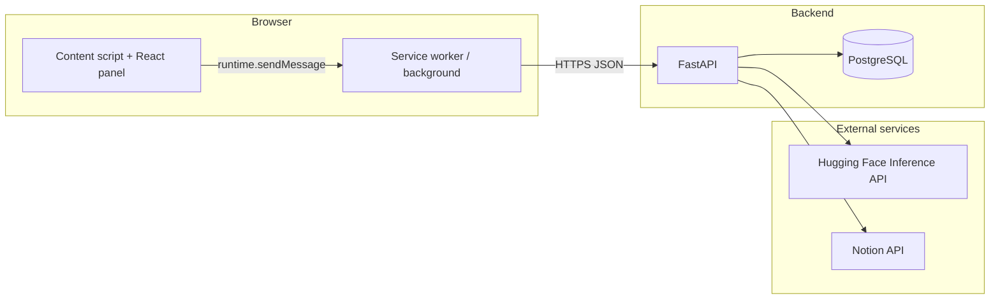

# AI for Kanban — Technical Overview

This document describes the **AI_for_Kanban** project: purpose, stack, architecture, data model, configuration, deployment, and known limitations. It reflects the codebase as of the document’s authoring date.

---

## 1. Purpose and scope

The project is a **minimal AI assistant for Kanban-style work**. Users chat with a language model, optionally backed by **Notion database context**, and can use a **browser extension** (“AS.YA”) that overlays sites such as Jira, Trello, or Notion.

- **Backend** owns authentication, persistence, Notion integration, and LLM calls.
- **Extension** is a thin client that talks to that API from the browser.

---

## 2. High-level architecture



- **Extension**: React UI runs in a **content script**. The **background** worker performs `fetch` to the API (avoids CORS for the panel) and stores tokens and an optional API base URL in **`browser.storage.local`**.
- **Backend**: **FastAPI** with **SQLAlchemy** and **PostgreSQL**; optional **Hugging Face** text generation; **Notion** via HTTP (integration token or OAuth).

---

## 3. Repository layout

| Area | Path | Role |
|------|------|------|
| API server | `backend/app/` | Routes, models, LLM, Notion, auth |
| API tests | `backend/tests/` | Pytest suite |
| API container | `backend/Dockerfile`, `backend/docker-compose.yml` | Python 3.12 image + Postgres 16 |
| Extension | `extension/` | WXT + React (Chromium MV3 / Firefox MV2) |

There is **no separate SPA** in this repository: the browser UI for end users is the **extension panel**.

---

## 4. Technology stack

### 4.1 Backend

| Component | Technology |
|-----------|------------|
| Language | Python 3.12 (see `backend/Dockerfile`) |
| Web framework | FastAPI, Uvicorn |
| ORM / DB driver | SQLAlchemy 2.x, psycopg (binary) → PostgreSQL |
| Configuration | pydantic-settings (`.env`, `app/config.py`) |
| Auth | python-jose (JWT access + refresh), FastAPI OAuth2 bearer dependency |
| LLM | huggingface_hub `InferenceClient.text_generation` |
| Notion | stdlib `urllib.request` + JSON; OAuth token exchange; signed OAuth `state` via JWT |
| Tests | pytest (optional run on application startup) |

### 4.2 Extension

| Component | Technology |
|-----------|------------|
| Build / tooling | WXT ~0.20, `@wxt-dev/module-react` |
| UI | React 18 |
| Targets | Chromium **MV3** (default); Firefox **MV2** (`wxt -b firefox`) |
| Permissions | `storage`, `activeTab`, `scripting`, `host_permissions: <all_urls>` |

---

## 5. Backend architecture

### 5.1 Application entry and lifecycle

- **`app/main.py`**: FastAPI app, route registration, **`Base.metadata.create_all`** on startup (schema sync; no Alembic migrations in-tree).
- **Startup tests**: If `RUN_TESTS_ON_STARTUP` is truthy (default **1**), `pytest -q tests` runs; a non-zero exit **aborts** server startup.

### 5.2 Module responsibilities

| Module | Responsibility |
|--------|------------------|
| `config.py` | Centralized settings (`DATABASE_URL`, JWT, HF, Notion OAuth) |
| `database.py` | SQLAlchemy engine + `SessionLocal` |
| `models.py` | ORM models and relationships |
| `schemas.py` | Pydantic request/response models |
| `deps.py` | DB session; `get_current_user` (decode access JWT, load `User`) |
| `auth.py` | Create/decode JWTs (`type`: `access` \| `refresh`) |
| `llm.py` | Build prompt from history + new message; call Hugging Face |
| `notion.py` | Notion REST, OAuth URL/state, context fetch, task lookup for decomposition |

### 5.3 API surface (summary)

- **Health**: `GET /health`
- **Auth**: `POST /auth/register`, `POST /auth/login`, `POST /auth/refresh`
- **Chats**: `POST` / `GET /chats`, `DELETE /chats/{chat_id}`
- **Messages**: `GET` / `POST /chats/{chat_id}/messages` — persists user message (+ attachment metadata), optionally prepends Notion context to the prompt, persists assistant reply
- **Notion**: connect (API key + database id), OAuth start/callback, status, context, disconnect
- **Tasks**: `POST /tasks/decompose-from-notion` — resolve task from Notion context, prompt LLM for structured decomposition, store assistant message

Full detail and examples: `backend/README.md` and OpenAPI at `http://localhost:8000/docs` when the server is running.

### 5.4 LLM behavior

- Default model: `HuggingFaceH4/zephyr-7b-beta` (override with `HF_MODEL`).
- History is flattened to **plain text** lines (`User:` / `Assistant:`), not a chat-specific HF chat API.
- Generation parameters (in code): `max_new_tokens=300`, `temperature=0.7`, `do_sample=True`.
- If `HF_TOKEN` is unset, the API stores messages but returns a placeholder assistant string indicating misconfiguration.

### 5.5 Notion behavior (conceptual)

- Per user: stored **`api_key`** (integration or OAuth token) and **`database_id`**.
- On chat messages: fetch a **limited** set of database rows, JSON-serialize into the user prompt as “Notion board context”.
- Decomposition endpoint uses a larger fetch limit and resolves a task by id/title within that context.

---

## 6. Data model

PostgreSQL tables (SQLAlchemy):

| Table | Purpose |
|-------|---------|
| `users` | `id` (string PK), `password` (stored as plain text in this demo implementation) |
| `chats` | UUID PK, FK to `users.id` |
| `messages` | UUID PK, FK to `chats.id`, `role` (`user` / `assistant`), `content`, `created_at` |
| `attachments` | UUID PK, FK to `messages.id`, `file_name`, `file_url` (metadata/URLs; no binary file storage in the reviewed code) |
| `notion_integrations` | `user_id` PK/FK, `api_key`, `database_id` |

Cascade deletes are configured from user → chats → messages → attachments, and user → notion integration.

---

## 7. Extension architecture

### 7.1 Content script (`extension/entrypoints/content/index.tsx`)

- Matches `*://*/*`, `runAt: document_idle`.
- Creates DOM node `kanban-ai-extension-root`, mounts **`ExtensionPanelApp`** with React.
- Listens for `togglePanel` from the background; dispatches window event `asya:toggle-panel` for the React UI.

### 7.2 Background (`extension/entrypoints/background/index.ts`)

- Toolbar click: uses `scripting` to inject CSS/JS when needed, then sends `togglePanel` to the active tab.
- **API base URL**: `browser.storage.local.apiBaseUrl`, normalized (default **`http://localhost:8000`**).
- **Message types**: `health`, `register`, `login`, `createChat`, `listChats`, `getMessages`, `sendMessage` (includes `attachments: []`), `saveTokens`.

### 7.3 Panel UI (`extension/src/components/ExtensionPanelApp.tsx`)

- Polls **`GET /health` every 5 seconds** to reflect backend availability.
- Auth via prompts for user id/password; register then login flow.
- After login: list chats, use first chat, load messages; send message through background.

### 7.4 Extension vs full API

The extension implements the subset documented in `extension/README.md`. Server endpoints for Notion and `decompose-from-notion` exist but may not be wired in `runtimeApi.ts` / background handlers yet—natural extension for future work.

---

## 8. Configuration

### Backend (`.env`)

See `backend/README.md` and `app/config.py` for:

- `DATABASE_URL` (and Compose-related Postgres variables)
- `JWT_SECRET`, `JWT_ALGORITHM`, `ACCESS_TOKEN_MINUTES`, `REFRESH_TOKEN_MINUTES`
- `HF_TOKEN`, `HF_MODEL`
- Notion OAuth: `NOTION_CLIENT_ID`, `NOTION_CLIENT_SECRET`, `NOTION_REDIRECT_URI`, `NOTION_OAUTH_STATE_TTL_MINUTES`

### Extension

- Optional `apiBaseUrl` in `browser.storage.local`.

### Operational toggles

- `RUN_TESTS_ON_STARTUP` — set `0` to skip pytest on API startup.

---

## 9. Deployment and local development

### Docker Compose (`backend/docker-compose.yml`)

- **db**: PostgreSQL 16, port 5432, named volume `pg_data`.
- **api**: image built from `backend/Dockerfile`, port **8000**, `env_file: .env`.

### Local (no Docker)

```text
python -m venv .venv
pip install -r backend/requirements.txt
uvicorn app.main:app --reload
```

Run from `backend/` with `DATABASE_URL` pointing at a live Postgres instance.

### Extension

```text
cd extension
npm install
npm run dev
```

Load unpacked output from `.output/chrome-mv3` (Chromium) or temporary add-on from `.output/firefox-mv2/manifest.json` (Firefox). See `extension/README.md`.

---

## 10. Testing

- Location: `backend/tests/` (`test_models.py`, `test_endpoints.py`, `conftest.py`).
- Manual: `pytest -q` from `backend/`.
- Optional: tests run automatically when the API starts unless `RUN_TESTS_ON_STARTUP=0`.

---

## 11. Security posture and limitations

This implementation is **intentionally simple** (see `backend/README.md`):

- Passwords are **not hashed**.
- Default JWT secret may be weak.
- No roles, audit trail, rate limiting, or extensive validation.
- Extension uses **broad** `host_permissions` for a generic overlay; review before any production use.

Treat this as a **course / prototype** baseline, not a production security model.

---

## 12. Related documentation

- `backend/README.md` — API endpoints, DB schema, env vars, Notion OAuth flow (Russian).
- `extension/README.md` — install, build, backend integration notes (English).

---

## Document history

- Initial version: technical overview consolidated from codebase review.
