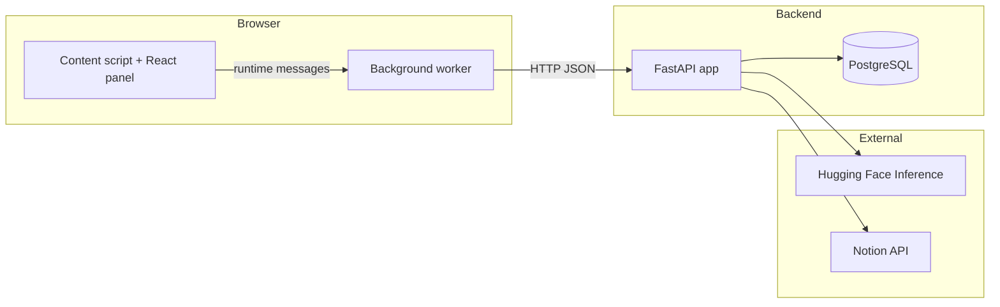

# AI for Kanban - Technical Overview

This document summarizes the current implementation of **AI_for_Kanban** across the backend API and browser extension.

---

## 1) Project Scope

AI_for_Kanban is a lightweight assistant for Kanban workflows:

- A FastAPI backend handles auth, chat persistence, Notion integration, and LLM calls.
- A browser extension injects a React panel into pages and proxies requests through the extension background script.

The backend and extension are both in this repository.

---

## 2) Architecture at a Glance



Key points:

- The extension panel never calls backend APIs directly; it calls the background script.
- The background script performs `fetch` to backend endpoints and normalizes errors.
- Tokens and extension config are stored in `browser.storage.local`.

---

## 3) Repository Layout

- `backend/app/` - API application code (routes, models, auth, Notion, LLM)
- `backend/tests/` - pytest suite for models/endpoints
- `backend/Dockerfile`, `backend/docker-compose.yml` - containerized API + PostgreSQL
- `extension/` - WXT + React browser extension
- `docs/` - project documentation

---

## 4) Technology Stack

### Backend

- Python 3.12 (Docker image)
- FastAPI + Uvicorn
- SQLAlchemy 2.x + psycopg + PostgreSQL
- pydantic-settings for environment/config
- python-jose for JWT
- huggingface_hub for inference client
- Standard library `urllib` for Notion REST and OAuth calls

### Extension

- WXT (`~0.20`) + React 18
- Chromium MV3 target
- Firefox MV2-compatible build target
- Permissions include `storage`, `activeTab`, `scripting`, and `<all_urls>` host access

---

## 5) Backend Design

### 5.1 App bootstrap and lifecycle

`backend/app/main.py`:

- Initializes FastAPI app (`title="AI Assistant Backend"`).
- Runs `Base.metadata.create_all(bind=engine)` on startup.
- Optionally runs tests on startup via `RUN_TESTS_ON_STARTUP` (default enabled).
  - If startup tests fail, app startup is aborted with `RuntimeError`.

### 5.2 Core modules

- `config.py`: central settings (DB, JWT, HF, Notion OAuth)
- `database.py`: SQLAlchemy engine/session factory
- `models.py`: ORM entities and relationships
- `schemas.py`: request/response validation models
- `auth.py`: JWT creation/verification (`access` and `refresh`)
- `deps.py`: DB dependency and current-user resolution from bearer token
- `notion.py`: Notion API access, OAuth state/token flow, context normalization
- `llm.py`: chat prompt assembly and model invocation (remote/local)

### 5.3 API surface (current)

- Health
  - `GET /health`

- Authentication
  - `POST /auth/register`
  - `POST /auth/login`
  - `POST /auth/refresh`

- Chats & messages
  - `POST /chats`
  - `GET /chats`
  - `DELETE /chats/{chat_id}`
  - `GET /chats/{chat_id}/messages`
  - `POST /chats/{chat_id}/messages`

- Notion integration
  - `POST /integrations/notion/connect`
  - `POST /integrations/notion/oauth/start`
  - `GET /integrations/notion/oauth/callback`
  - `GET /integrations/notion/status`
  - `GET /integrations/notion/context`
  - `DELETE /integrations/notion`

- Task decomposition
  - `POST /tasks/decompose-from-notion`

### 5.4 Message flow (`POST /chats/{chat_id}/messages`)

1. Validate chat ownership for authenticated user.
2. Persist user message + optional attachment metadata.
3. If Notion integration exists, fetch up to 10 records and append serialized context to prompt.
4. Generate assistant response with LLM.
5. Persist assistant message.
6. Return both user and assistant messages.

### 5.5 Task decomposition flow (`POST /tasks/decompose-from-notion`)

1. Ensure Notion integration exists for current user.
2. Validate chat ownership.
3. Fetch up to 50 Notion items.
4. Find target task by `task_id` or exact normalized `task_title`.
5. Build decomposition prompt and generate assistant output.
6. Save assistant output as a chat message.
7. Return saved message and resolved source task.

---

## 6) Data Model

Defined in `backend/app/models.py`:

- `users`
  - `id` (string PK)
  - `password` (string, stored as plain text)

- `chats`
  - `id` (UUID PK)
  - `user_id` (FK -> users.id)

- `messages`
  - `id` (UUID PK)
  - `chat_id` (FK -> chats.id)
  - `role` (string, expected user/assistant)
  - `content` (text)
  - `created_at` (UTC timestamp)

- `attachments`
  - `id` (UUID PK)
  - `message_id` (FK -> messages.id)
  - `file_name` (string)
  - `file_url` (text)

- `notion_integrations`
  - `user_id` (PK + FK -> users.id)
  - `api_key` (text)
  - `database_id` (string)

Relationships use cascade delete for dependent rows.

---

## 7) LLM Integration

Implemented in `backend/app/llm.py`.

### Prompt format

- Builds a chat message array with:
  - system prompt: `"You are a helpful assistant. Keep answers concise."`
  - prior history mapped from stored `Message` rows
  - new user message

### Execution modes

1. **Remote HF inference (default)**
   - Uses `InferenceClient.chat_completion(...)`
   - Params: `max_tokens=300`, `temperature=0.7`
   - Optional provider override: `HF_INFERENCE_PROVIDER`

2. **Local transformers mode**
   - Enabled with `HF_LOCAL_TRANSFORMERS=1`
   - Loads model via `AutoModelForImageTextToText` + `AutoProcessor`
   - Requires extra deps from `requirements-llm.txt`

### Failure behavior

- If `HF_TOKEN` is missing, backend still stores messages but returns:
  - `"HF_TOKEN is not configured. Message stored without model response."`
- Includes explicit fallback/error messages for provider/model mismatch and HTTP/client errors.

---

## 8) Notion Integration

Implemented in `backend/app/notion.py` plus API routes in `main.py`.

Capabilities:

- Direct connect via `api_key + database_id` with live access validation.
- OAuth connect flow with signed JWT `state` that contains user and database IDs.
- Context fetch from Notion database query with normalized properties.
- Task lookup by id or normalized exact title.

Normalization currently extracts common Notion property types:

- status/select/multi_select
- date/number/checkbox
- rich_text/title

---

## 9) Extension Design

### 9.1 Content script

`extension/entrypoints/content/index.tsx`:

- Injects on `*://*/*` at `document_idle`.
- Mounts React app into `#kanban-ai-extension-root`.
- Listens for runtime `togglePanel` and dispatches `asya:toggle-panel` window event.

### 9.2 Background worker

`extension/entrypoints/background/index.ts`:

- Handles toolbar click, injects content assets if needed, then toggles panel.
- Exposes runtime API bridge for:
  - `health`, `register`, `login`, `createChat`, `listChats`, `getMessages`, `sendMessage`, `saveTokens`
- Normalizes API base URL from `browser.storage.local.apiBaseUrl` (default `http://localhost:8000`).
- Persists tokens in extension local storage.

### 9.3 Panel app

`extension/src/components/ExtensionPanelApp.tsx`:

- Polls backend `/health` every 5 seconds.
- Register/login via prompt dialogs.
- Loads existing chats and message history after login.
- Creates chats and sends messages.
- Displays recent message preview.

Current extension scope is chat/auth focused; Notion endpoints and task decomposition are backend-ready but not yet exposed in extension runtime API.

---

## 10) Configuration

### Backend environment

From `backend/app/config.py` and `.env.example`:

- Database: `DATABASE_URL`
- JWT: `JWT_SECRET`, `JWT_ALGORITHM`, `ACCESS_TOKEN_MINUTES`, `REFRESH_TOKEN_MINUTES`
- HF: `HF_TOKEN`, `HF_MODEL`, `HF_INFERENCE_PROVIDER`, `HF_LOCAL_TRANSFORMERS`
- Notion OAuth: `NOTION_CLIENT_ID`, `NOTION_CLIENT_SECRET`, `NOTION_REDIRECT_URI`, `NOTION_OAUTH_STATE_TTL_MINUTES`
- Startup testing: `RUN_TESTS_ON_STARTUP`

### Extension runtime config

- `apiBaseUrl` in `browser.storage.local`
- `tokens` in `browser.storage.local`

---

## 11) Local Development and Deployment

### Backend with Docker

`backend/docker-compose.yml` runs:

- `db` (PostgreSQL 16)
- `api` (FastAPI container from `backend/Dockerfile`, exposed on `:8000`)

### Backend local run (without full Docker stack)

From `backend/`:

```text
python -m venv .venv
pip install -r requirements.txt
uvicorn app.main:app --reload
```

### Extension local run

From `extension/`:

```text
npm install
npm run dev
```

For Firefox:

```text
npm run dev:firefox
```

---

## 12) Testing

- Backend tests are in `backend/tests/`.
- Manual run from `backend/`: `pytest -q`
- Optional startup enforcement via `RUN_TESTS_ON_STARTUP`.

---

## 13) Security and Limitations

Current implementation is intentionally simple/prototype-grade:

- Passwords are stored unhashed.
- No RBAC/roles, audit logging, or rate limiting.
- Minimal validation beyond schema checks.
- Broad extension host permissions (`<all_urls>`).

This should be treated as an educational/prototype baseline, not production-ready security.

---

## 14) Related Docs

- `backend/README.md` - backend setup and endpoint walkthrough
- `extension/README.md` - extension setup/build/load instructions
