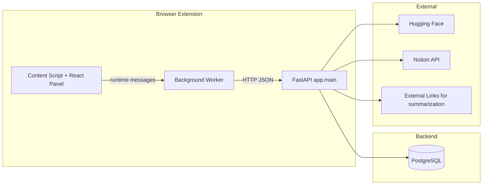

# AI for Kanban — Technical Overview

Этот документ отражает **актуальное техническое состояние** проекта `AI_for_Kanban` (backend + browser extension) на текущем этапе разработки.

---

## 1. Назначение системы

Проект реализует AI-ассистента для канбан-процесса:

- Backend на FastAPI предоставляет auth, chat API, интеграцию с Notion, суммаризацию, semantic search и task decomposition.
- Browser extension (WXT + React) встраивает панель на страницу и работает через background-bridge к backend API.

---

## 2. Архитектура


```mermaid
flowchart LR
  subgraph Browser Extension
    CS[Content Script + React Panel]
    BG[Background Worker]
    CS -->|runtime messages| BG
    BG -->|HTTP JSON| API
  end

  subgraph Backend
    API[FastAPI app.main]
    DB[(PostgreSQL)]
    API --> DB
  end

  subgraph External
    HF[Hugging Face]
    Notion[Notion API]
    Web[External Links for summarization]
  end

  API --> HF
  API --> Notion
  API --> Web
```

Ключевые принципы:

- UI не обращается к backend напрямую: только через `browser.runtime.sendMessage` -> background.
- Background централизует HTTP-вызовы и преобразует backend errors в строковое сообщение.
- Сессия extension хранится в `browser.storage.local` (`tokens`, `activeChatId`, `panelMode`, `apiBaseUrl`).

---

## 3. Структура репозитория

- `backend/app/` — FastAPI приложение (роуты, бизнес-логика, интеграции, ORM)
- `backend/tests/` — pytest тесты
- `backend/docker-compose.yml`, `backend/Dockerfile` — запуск API + PostgreSQL
- `extension/` — WXT extension
  - `entrypoints/background/index.ts` — runtime bridge + toolbar toggle
  - `entrypoints/content/index.tsx` — инъекция панели
  - `src/components/ExtensionPanelApp.tsx` — основной UI и клиентская логика
- `docs/` — документация проекта

---

## 4. Технологический стек

### Backend

- Python 3.x
- FastAPI + Uvicorn
- SQLAlchemy + PostgreSQL (psycopg)
- Pydantic / pydantic-settings
- `python-jose` (JWT)
- `huggingface_hub` (LLM inference)
- `urllib` (fetch внешнего HTML для summary-by-link)

### Extension

- WXT `0.20.x`
- React 18
- TypeScript
- Сборки:
  - Chromium MV3 (`npm run build`)
  - Firefox MV2-compatible (`npm run build:firefox`)

---

## 5. Backend: API и поведение

### 5.1 Lifecycle

`backend/app/main.py`:

- `Base.metadata.create_all(bind=engine)` на старте.
- Опциональный запуск тестов при старте (`RUN_TESTS_ON_STARTUP=1` по умолчанию).

### 5.2 Основные endpoints

- Health:
  - `GET /health`

- Auth:
  - `POST /auth/register`
  - `POST /auth/login`
  - `POST /auth/refresh`

- Chats/Messages:
  - `POST /chats`
  - `GET /chats`
  - `DELETE /chats/{chat_id}`
  - `GET /chats/{chat_id}/messages`
  - `POST /chats/{chat_id}/messages`

- Summarization & semantic:
  - `POST /summaries` (text/link + optional context/chat)
  - `POST /search/semantic`

- Notion:
  - `POST /integrations/notion/connect`
  - `POST /integrations/notion/oauth/start`
  - `GET /integrations/notion/oauth/callback`
  - `GET /integrations/notion/status`
  - `GET /integrations/notion/databases`
  - `GET /integrations/notion/context`
  - `DELETE /integrations/notion`

- Decomposition:
  - `POST /tasks/decompose-from-notion`

### 5.3 Особенности текущей логики

- `POST /chats/{chat_id}/messages`:
  - сохраняет user message + attachments;
  - при активной Notion integration дополняет prompt контекстом доски;
  - сохраняет assistant reply.

- `POST /search/semantic`:
  - BM25-подобный поиск по Notion и chat-history;
  - возвращает `notion_matches`, `chat_matches`, `information_matches`;
  - сохраняет результат как сообщения вида `[SEMANTIC SEARCH] ...`.

- `POST /summaries`:
  - поддерживает суммаризацию текста или ссылки;
  - при `link` может извлекать текст из HTML страницы.

- Notion интеграция:
  - поддерживает и API-key connect, и OAuth flow;
  - синхронизирует список доступных databases (`notion_databases`), помечая default.

---

## 6. Data model (ORM)

Основные таблицы:

- `users` (`id`, `password`)
- `chats` (`id`, `user_id`)
- `messages` (`id`, `chat_id`, `role`, `content`, `created_at`)
- `attachments` (`id`, `message_id`, `file_name`, `file_url`)
- `notion_integrations` (`user_id`, `api_key`, `database_id`)
- `notion_databases` (пер-пользовательский список доступных баз, default-флаг)

---

## 7. Extension: runtime API bridge

`extension/entrypoints/background/index.ts` обрабатывает runtime команды:

- Auth/chat: `register`, `login`, `createChat`, `listChats`, `getMessages`, `sendMessage`
- Session: `loadSession`, `saveSession`, `saveTokens`
- Notion: `startNotionOAuth`, `getNotionStatus`, `listNotionDatabases`, `listNotionContext`, `connectApi`
- AI tools: `summarizeText`, `findInText`, `decomposeTask`

Все ошибки backend преобразуются в `{ __error: message }`, затем пробрасываются в UI через `runtimeApi.ts`.

---

## 8. Extension UI (ExtensionPanelApp)

Текущее состояние панели:

- Режимы: `home`, `chat`, `settings`
- Auth flow: login/register с password toggle
- Chat UX:
  - bubble-отображение user/assistant сообщений
  - pending-сообщение (`Preparing...`) во время запроса
  - markdown-render assistant сообщений
  - очистка чата (`Clear chat`) с защитой от stale responses
  - sticky composer снизу в chat mode
- Settings:
  - Notion connection card
  - выбор базы данных из `listNotionDatabases`
  - OAuth запуск с учетом выбранной `database_id`

---

## 9. Конфигурация

### Backend `.env`

Ключевые переменные:

- `DATABASE_URL`
- `JWT_SECRET`, `JWT_ALGORITHM`, `ACCESS_TOKEN_MINUTES`, `REFRESH_TOKEN_MINUTES`
- `HF_TOKEN`, `HF_MODEL`, `HF_INFERENCE_PROVIDER`, `HF_LOCAL_TRANSFORMERS`
- `NOTION_CLIENT_ID`, `NOTION_CLIENT_SECRET`, `NOTION_REDIRECT_URI`, `NOTION_OAUTH_STATE_TTL_MINUTES`
- `RUN_TESTS_ON_STARTUP`

### Extension runtime storage

- `apiBaseUrl` (default `http://localhost:8000`)
- `tokens`
- `activeChatId`
- `panelMode`

---

## 10. Запуск и сборка

### Backend (local)

```bash
cd backend
python -m venv .venv
.\.venv\Scripts\Activate.ps1
python -m pip install -r requirements.txt
python -m uvicorn app.main:app --reload
```

### Backend (Docker)

```bash
cd backend
docker compose up --build
```

### Extension

```bash
cd extension
npm install
npm run dev
```

Build:

```bash
npm run build
npm run build:firefox
```

---

## 11. Текущие ограничения и риски

- Пароли пользователей хранятся без хеширования (prototype-grade security).
- Ошибки режимов в UI дружелюбно агрегируются, поэтому детальная причина видна в backend логах.
- Notion endpoints (`/integrations/notion/context`, `/tasks/decompose-from-notion`) могут отдавать `400/502` при недоступности/невалидности внешнего контекста.
- Широкие host permissions extension (`<all_urls>`).

---

## 12. Связанные документы

- `backend/README.md` — запуск backend и API flow
- `extension/README.md` — запуск/сборка extension
